# Genomes and genealogies

## Genomes

> - are very big ($10^7$--$10^{12}$ nucleotides)
> - encode the basic *mechanisms* of life
> - reflect past *history* and *process*

## 

Your two copies of the genome
were inherited, noisily, from your two parents,

. . .

and from your four grandparents,

. . .

and your eight great-grandparents

. . .

and your sixteen great-great-grandparents

. . .

... see where this is going?

## Genealogical ancestors

In a well-mixed population of size $N$,

- A most recent common ancestor of *everyone* lived at $\approx \log 2 N$ generations ago.

- For humans: $\approx 500$ years; 
    but including geography and history, $\approx$ 2--3 thousand years
    (Chang ’99; Rohde, Olson & Chang ’04)

- *Everyone* alive $\approx 1.77 \log_2 N$ generations ago
    is either an ancestor of everyone or has left behind no descendants. (Chang ’99)

## Meiosis & Recombination

::: {.columns}
::::::: {.column width=50%}

:::
::::::: {.column width=50%}

- You have two copies of each chromosome, 
  one from each parent.

- When you make a gamete, the copies *recombine*, at Poisson($\rho$) locations.

- *Mutations* appear at Poisson($\mu$) locations.

:::
::::::

## You and your great${}^{k-1}$-grand parents

The number of $k^\text{th}$ *genetic* ancestors
grows *linearly* with $k$.

::: {.centered}

:::

::: {.caption}
from [gcbias.org](https://gcbias.org/2013/11/11/how-does-your-number-of-genetic-ancestors-grow-back-over-time/)
:::

## 

::: {.centered}
{width=60%}
:::

::: {.caption}
from [gcbias.org](https://gcbias.org/2013/11/11/how-does-your-number-of-genetic-ancestors-grow-back-over-time/)
:::

## 

::: {.centered}
{width=60%}
:::

::: {.caption}
from [gcbias.org](https://gcbias.org/2013/11/11/how-does-your-number-of-genetic-ancestors-grow-back-over-time/)
:::

## 

::: {.centered}
{width=60%}
:::

::: {.caption}
from [gcbias.org](https://gcbias.org/2013/11/11/how-does-your-number-of-genetic-ancestors-grow-back-over-time/)
:::

## 

::: {.centered}
{width=60%}
:::

::: {.caption}
from [gcbias.org](https://gcbias.org/2013/11/11/how-does-your-number-of-genetic-ancestors-grow-back-over-time/)
:::

## 

::: {.centered}
{width=60%}
:::

::: {.caption}
from [gcbias.org](https://gcbias.org/2013/11/11/how-does-your-number-of-genetic-ancestors-grow-back-over-time/)
:::

#

##

Everyone is related by a vast genealogical network.

. . .

We get to observe *genomes*, noisily transmitted through it.

. . .

What can we learn about its structure? history? biology?

<!-- the ARG -->
#  The coalescent with recombination

##

::: {.columns}
::::::: {.column width=50%}

In a *randomly mating* population of size $N$,
ancestry of some chromosomes follows a
*fragmentation-coalescence process*:

- labeled ancestral blocks assort into *ancestors*
-  ancestors *split* at a uniform location at rate 1 
-  each pair of ancestors *coalesces* at rate 1  

:::: {.greyed}
Result: the *Ancestral Recombination Graph*, or ARG.
(Griffiths & Marjoram)
:::::

:::
::::::: {.column width=50%}

:::: {.floatright}
{width=80%}
::::

:::
::::::: 

##

::: {.columns}
::::::: {.column width=50%}

In a *randomly mating* population of size $N$,
ancestry of some chromosomes follows a
*fragmentation-coalescence process*:

- labeled ancestral blocks assort into *ancestors*
- ancestors *split* at a uniform location at rate 1
-  each pair of ancestors *coalesces* at rate 1 

:::: {.greyed}
Result: the *Ancestral Recombination Graph*, or ARG.
(Griffiths & Marjoram)
:::::

:::
::::::: {.column width=50%}

:::: {.floatright}
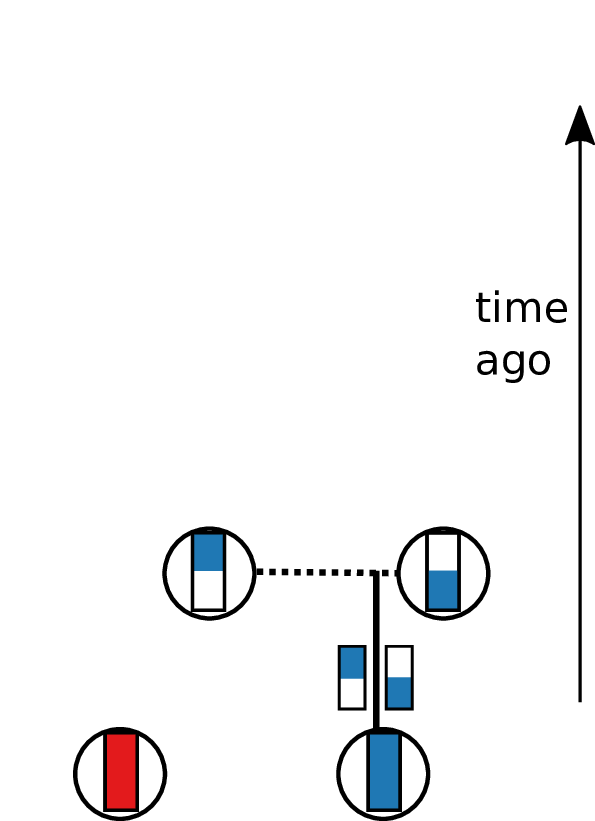{width=80%}
::::

:::
::::::: 

##

::: {.columns}
::::::: {.column width=50%}

In a *randomly mating* population of size $N$,
ancestry of some chromosomes follows a
*fragmentation-coalescence process*:

- labeled ancestral blocks assort into *ancestors*
- ancestors *split* at a uniform location at rate 1
- each pair of ancestors *coalesces* at rate 1

:::: {.greyed}
Result: the *Ancestral Recombination Graph*, or ARG.
(Griffiths & Marjoram)
:::::

:::
::::::: {.column width=50%}

:::: {.floatright}
{width=80%}
::::

:::
::::::: 

##

::: {.columns}
::::::: {.column width=50%}

In a *randomly mating* population of size $N$,
ancestry of some chromosomes follows a
*fragmentation-coalescence process*:

- labeled ancestral blocks assort into *ancestors*
- ancestors *split* at a uniform location at rate 1
- each pair of ancestors *coalesces* at rate 1

:::: {.greyed}
Result: the *Ancestral Recombination Graph*, or ARG.
(Griffiths & Marjoram)
:::::

:::
::::::: {.column width=50%}

:::: {.floatright}
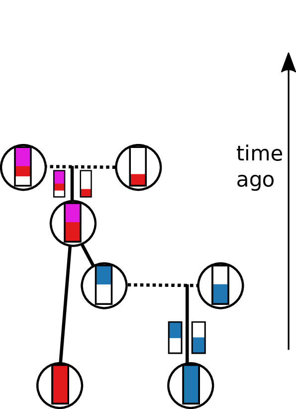{width=80%}
::::

:::
::::::: 

##

::: {.columns}
::::::: {.column width=50%}

In a *randomly mating* population of size $N$,
ancestry of some chromosomes follows a
*fragmentation-coalescence process*:

- labeled ancestral blocks assort into *ancestors*
- ancestors *split* at a uniform location at rate 1
- each pair of ancestors *coalesces* at rate 1

:::: {.greyed}
Result: the *Ancestral Recombination Graph*, or ARG.
(Griffiths & Marjoram)
:::::

:::
::::::: {.column width=50%}

:::: {.floatright}
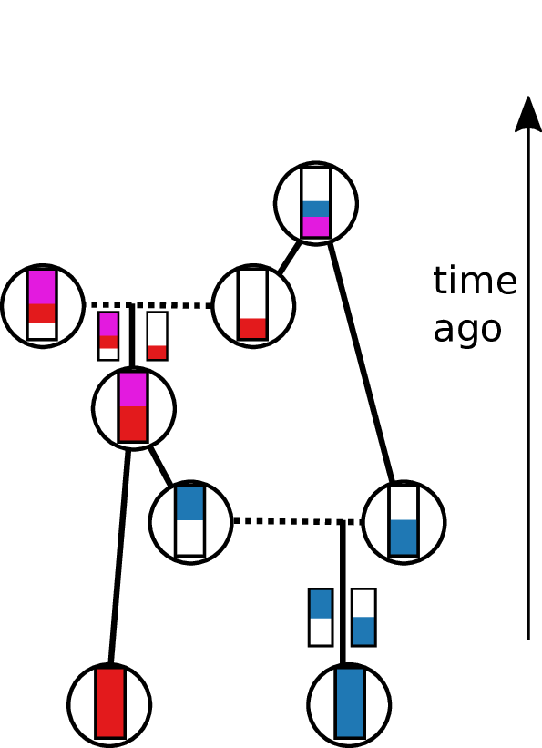{width=80%}
::::

:::
::::::: 

##

::: {.columns}
::::::: {.column width=50%}

In a *randomly mating* population of size $N$,
ancestry of some chromosomes follows a
*fragmentation-coalescence process*:

- labeled ancestral blocks assort into *ancestors*
- ancestors *split* at a uniform location at rate 1
- each pair of ancestors *coalesces* at rate 1

:::: {.greyed}
Result: the *Ancestral Recombination Graph*, or ARG.
(Griffiths & Marjoram)
:::::

:::
::::::: {.column width=50%}

:::: {.floatright}
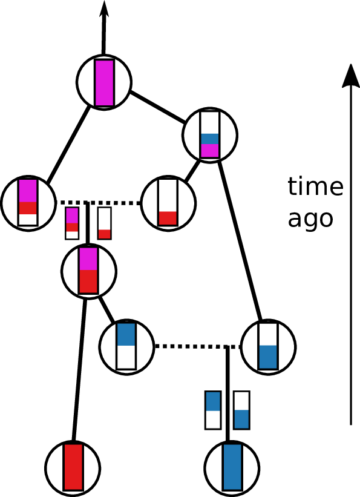{width=80%}
::::

:::
::::::: 

##

::: {.columns}
::::::: {.column width=50%}

In a *randomly mating* population of size $N$,
ancestry of some chromosomes follows a
*fragmentation-coalescence process*:

- labeled ancestral blocks assort into *ancestors*
- ancestors *split* at a uniform location at rate 1
- each pair of ancestors *coalesces* at rate 1

Result: the *Ancestral Recombination Graph*, or ARG.
(Hudson; Griffiths & Marjoram)

:::
::::::: {.column width=50%}

:::: {.floatright}
{width=80%}
::::

:::
::::::: 

## Simulation

[`msprime`](https://github.com/jeromekelleher/msprime): whole genomes with $N \sim 10^5$ in $O(\text{minutes})$

by [Kelleher, Etheridge, & McVean 2016](http://journals.plos.org/ploscompbiol/article?id=10.1371/journal.pcbi.1004842) 

::: {.floatright}
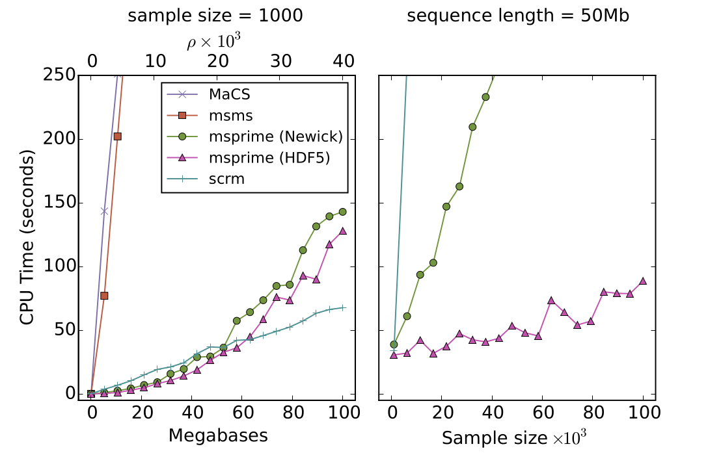{width=65%}
{width=30%}

:::: {.caption}
jerome kelleher
::::

:::

# Forwards simulation

## 

Coalescent simulations are *much faster*
than forwards-time, individual-based simulations

. . .

because they don't have to keep track of *everyone*,
only the ancestors of your sample.

. . .

**But:** coalescent theory relies on a *duality* that is broken by
natural selection or real geography.

---------------------------

To study evolution or understand populations across real geography,
we need individual-based, forwards-time simulations.

. . .

Then every individual needs to carry around her genotype (somehow).
Even at neutral sites!

. . .

**Bummer.**

. . .

*But wait...*

## 

If we *record the tree sequence*
that relates everyone to everyone else,

after the simulation is over we can put neutral mutations down on the trees.

. . .

Since neutral mutations don't affect demography,

this is *equivalent* to having kept track of them throughout.

------------

This means recording the entire genetic history of **everyone** in the population, **ever**.

.  . .

It is *not* clear this is a good idea.

<!-- explain tree sequences and why they are so efficient (5min) -->
# The tree sequence

## History is a sequence of trees

For a set of sampled chromosomes,
at each position along the genome there is a genealogical tree
that says how they are related.

. . .

{width=100%}

----------------------

The **succinct tree sequence**

::: {.floatright}
is a way to succinctly describe this, er, sequence of trees.
:::

---------------

---------------

---------------

-------------

[Kelleher, Etheridge, and McVean](http://journals.plos.org/ploscompbiol/article?id=10.1371/journal.pcbi.1004842) 
introduced the **tree sequence** data structure
for a fast coalescent simulator, [msprime](https://github.com/jeromekelleher/msprime).
*(updated in Kelleher, Thornton, Ashander, and R.; 2018)*

- stores sequence *and* genealogical data **very** efficiently

- tree-based sequence storage closely related to haplotype-matching compression

- python/C [`tskit`](https://github.com/tskit-dev/tskit) tools

::: {.floatright}
{width=50%}

:::: {.caption}
jerome kelleher
::::
:::

## File sizes

::: {.centered}
{width=90%}
:::

::: {.caption}
100Mb chromosomes;
from [Kelleher et al 2018, *Inferring whole-genome histories in large population datasets*](https://www.nature.com/articles/s41588-019-0483-y), Nature Genetics
:::

<!-- Estimated sizes of files required to store the genetic variation data for a
simulated human-like chromosome (100 megabases) for up to 10 billion haploid
(5 billion diploid) samples. Simulations were run for 10 1 up to 10 7 haplotypes
using msprime [Kelleher et al., 2016], and the sizes of the resulting files plotted
(points). -->

## Example: three samples; two trees; two variant sites

-----------------------

Storing a tree sequence in
the four tables - *nodes*, *edges*, *sites*, and *mutations* -
is *succinct* (no redundancy).

. . .

These are stored efficiently on disk
with a bit more information (e.g., metadata).

## Nodes and edges

Edges 

:   Who inherits from who; only *necessary* for coalescent events.

    Records: interval (left, right); parent node; child node.

Nodes 

:   The ancestors those happen in.

    Records: time ago (of birth); ID (implicit).

-------------------

-------------------

-------------------

-------------------

-------------------

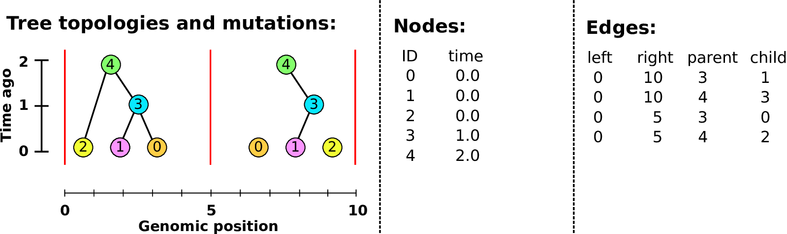

-------------------

-------------------

## Sites and mutations

Mutations

:   When state changes along the tree.

    Records: site it occured at; node it occurred in; derived state.

Sites 

:   Where mutations fall on the genome.

    Records: genomic position; ancestral (root) state; ID (implicit).

------------------

------------------

------------------

------------------

------------------

## How efficient?

Consider a tree $T$ with total length $|T|$,
that extends for distance $W$ along the genome.

> - The number of mutations on $T$ is $\propto \mu W |T|$.
> - $\E[W] = \rho |T|$.
> - Most adjacent trees differ by $\approx$ 4 edges.

. . .

So, the number of required entries should be
$$
    O\left((\rho + \mu) |T|\right) .
$$

## Mean area of a tree?

> - In a neutral, randomly mating population of size $N$,
>     the mean time with $k$ lineages is $4N / (k (k-1))$.
> 
> - So, for a tree with $n$ leaves,
>     $$
>         \E[|T|] = \sum_{k=2}^n \frac{4N}{k-1} \approx 4N \log n .
>     $$

. . .

Trees *and* genotypes of $n$ samples for a genome of length $L$
    should be storable in
    $$
        O\left( (\rho + \mu) L N \log n \right) .
    $$

<!-- application to fwds sim recording (5min) -->
# Forwards-time tree sequence recording

## Tree recording strategy

Every time an individual is born, we must:

::: incremental

1. add each gamete to the Node Table,
2. add entries to the Edge Table
    recording which parent each gamete inherited each bit of genome from, and
3. add any new selected mutations to the Mutation Table 
    and (if necessary) their locations to the Site Table.

:::

. . .

::: {.columns}
:::::: {.column width=15%}

{width="100%"}

:::
:::::: {.column width=5%}

:::
:::::: {.column width=75%}

This produces **waaaaay** too much data.

:::
::::::

-------------------

We won't end up needing the *entire* history
of *everyone ever*,

. . .

but we won't know *what* we'll need until later.

. . .

How do we get rid of the extra stuff?

## Simplification

*Question:* given a tree sequence
containing the history of many individuals,
how do we *simplify* it to only the history
of a subset?

-----------

Given 
an input tree sequence
and a subset of its nodes we call the *samples*,

we want a new tree sequence for which:

1. All marginal subtrees agree.

2. All non-sample nodes have at least two children in every tree.

3. All nodes and edges are ancestral to at least one sample.

4. No mergeable edges 
    (e.g., $(\ell, x, p, c) + (x, r, p, c) \rightarrow (\ell, r, p, c)$).

-----------

*Answer:* to simplify a tree sequence
to the history of the *samples*:

1. Paint each *sampled* chromosome a distinct color.

2. Moving back up the tree sequence,
    copy colors of each chromosome to the parental chromosomes
    they inherited from.

3. If two colors go in the same spot (*coalescence*),
    replace with a new color (unique to that ancestor).
    Output a node for the ancestor and an edge for the coalescence.

4. Once all colors have coalesced in a given segment,
    stop propagating it.

## An example: simplify these to J and K

{ width="100%" }

-------------------

{ width="100%" }

-------------------

{ width="100%" }

-------------------

{ width="100%" }

-------------------

{ width="100%" }

-------------------

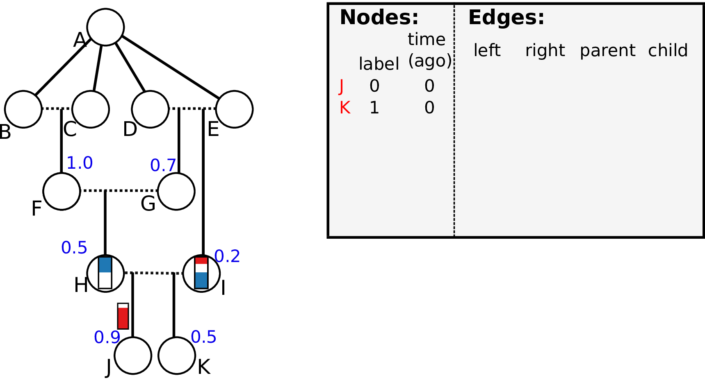{ width="100%" }

-------------------

{ width="100%" }

-------------------

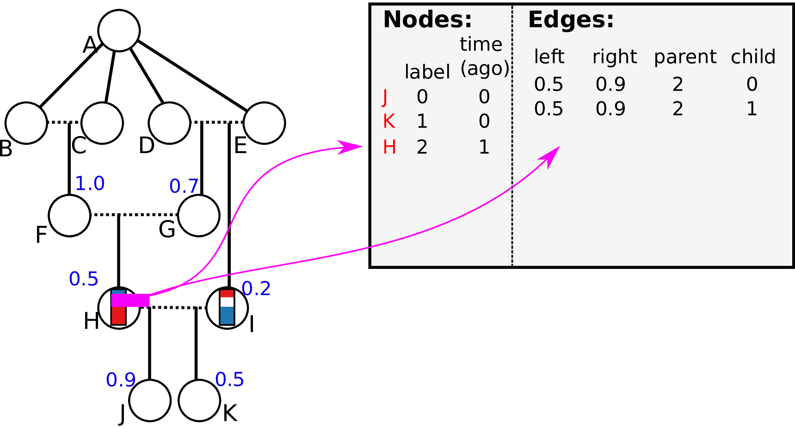{ width="100%" }

-------------------

{ width="100%" }

-------------------

{ width="100%" }

-------------------

{ width="100%" }

-------------------

{ width="100%" }

-------------------

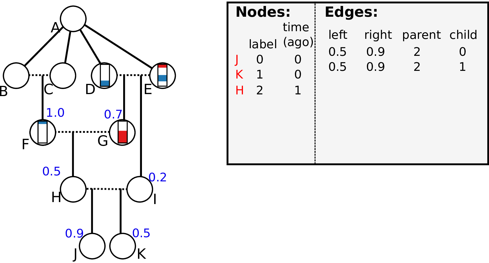{ width="100%" }

-------------------

{ width="100%" }

-------------------

{ width="100%" }

-------------------

{ width="100%" }

-------------------

{ width="100%" }

## Wright-Fisher, N=10: before simplification

## Wright-Fisher, N=10: before simplification

## ... and after simplification

## *Revised* tree recording strategy

Every time an individual is born, we must:

1. add each gamete to the Node Table,
2. add entries to the Edge Table
    recording which parent each gamete inherited each bit of genome from
3. add any new mutations to the Mutation Table 
    and (if necessary) their locations to the Site Table.

... and,

4. Every so often, *simplify* the tables so far,
    retaining the history of the current generation.

## Implementation

::: {.centered}
{width=65%}
:::

::: {.floatright .caption}
Kelleher, Thornton, Ashander, and R. (2018)

Haller, Galloway, Kelleher, Messer & R. (2018)
:::

## It works!

::: {.columns}
::::::: {.column width=60%}

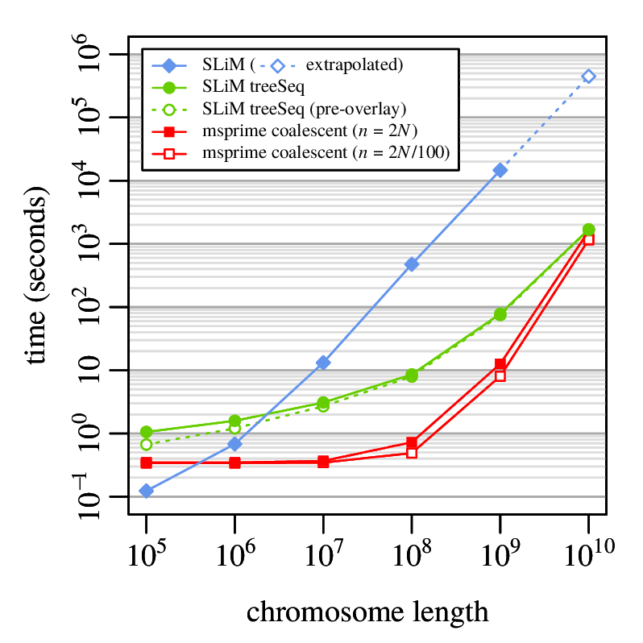{width=100%}

:::
::::::: {.column width=40%}

::: {.caption}
**SLiM:** forwards-time, individual-based, with selection on whole genomes, continuous geography, etcetera.
(Haller & Messer).

Note: with "treeSeq",
the neutral mutation rate was *zero*
but neutral mutations were added *afterwards*.
:::

:::
:::::::

<!--
## Simulation parameters

1. Wright-Fisher population of size $N$
2. simulated for $10N$ genreations
3. neutral mutation rate $\mu$ equal to recombination rate $r$ per gamete
4. many, weakly deleterious mutations: rate $\mu/100$ with
    $s$ exponentially distributed with mean $2.5/N$.

--------------------------

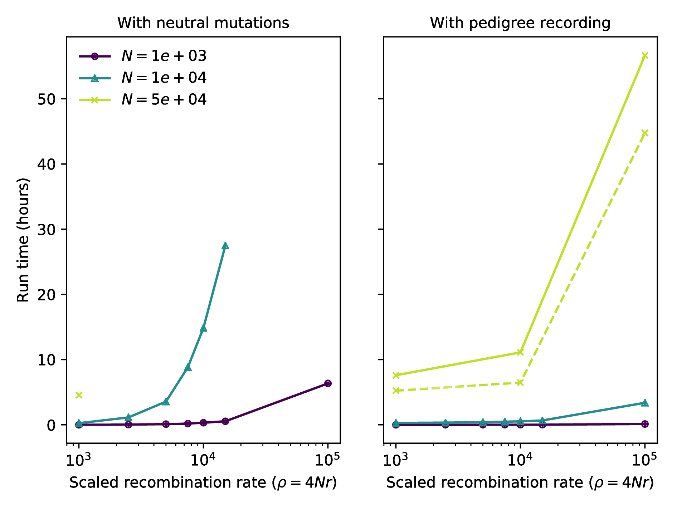{ width=80% }

--------------------------

{ width=80% }

-->

# Summarizing genomes and genealogies

## Fast genotype statistics

::: {.centered}
{width=70%}
:::

::: {.caption}
from [R., Thornton and Kelleher 2019, *Efficiently summarizing relationships in large samples*](https://www.biorxiv.org/content/10.1101/779132v1?rss=1), bioRxiv
:::

##

**What do genotypes tell us about the genealogies?**

::: {.caption}
from [R., Thornton and Kelleher 2019, *Efficiently summarizing relationships in large samples*](https://www.biorxiv.org/content/10.1101/779132v1?rss=1), bioRxiv
:::

## Summaries of genotypes and genealogies

::: {.columns}
:::::: {.column width=47%}

*Genotypes:*

1. For each site,
2. look at who has which alleles,
3. and add a *summary* of these values to our running total.

*Example:*
genetic distance
counts how many mutations differ between two sequences.

:::
:::::: {.column width=5%}

:::
:::::: {.column width=47%}

<!-- nothing til next slide -->

:::
::::::

## Summaries of genotypes and genealogies

::: {.columns}
:::::: {.column width=47%}

*Genotypes:*

1. For each site,
2. look at who has inherited which alleles,
3. and add a *summary* of these values to the running total.

*Example:*
sequence divergence
counts how many mutations differ between two sequences.

:::
:::::: {.column width=5%}

:::
:::::: {.column width=47%}

*Trees:*

1. For each branch,
2. look at who would inherit mutations on that branch,
3. and add the *expected contribution* to the running total.

*Example:*
the mean time to most recent common ancestor between two sequences.

:::
::::::

##

##

Given

1. a *weight* $w_i \in \mathbb{R}^n$ to each *sample node*, and
2. a *summary function* $f : \mathbb{R}^n \to \mathbb{R}$,

. . .

the **Site** statistic 
$$\begin{equation}
 \text{Site}(f,w) = \sum_{i: \text{sites}} \sum_{a: \text{alleles}_i} f(w_a)
\end{equation}$$
is the total summarized weights of all *alleles* at all sites,

. . .

and the **Branch** statistic 
$$\begin{equation}
 \text{Branch}(f,w) = \sum_{T: \text{trees}} s_T \sum_{b: \text{branches}_T} f(w_b) \ell_b
\end{equation}$$
is the *expected value* of $\text{Site}(f,w)$ under Poisson(1) mutation, given the trees.

## Duality

Any set of *sample weights* $w$ and *summary function* $f$
defines both

- a statistic of genotypes, $\text{Site}(f,w)$, and
- a statistic of genealogies, $\text{Branch}(f,w)$.

. . .

With genealogies *fixed*, and averaging only over *mutations* with rate $\mu$,
$$\begin{equation}
    \text{Branch}(f, w) = \frac{1}{\mu} \E\left[ \text{Site}(f, w) \right] .
\end{equation}$$

. . .

Dealing directly with genealogies can
*remove the layer of noise due to mutation*:
$$\begin{equation}
    \frac{1}{\mu^2} \var\left[\text{Site}(f,w)\right]
    =
    \var\left[\text{Branch}(f,w)\right]
    +
    \frac{1}{n}
    \E\left[\text{Branch}(f^2,w)\right]
\end{equation}$$

::: {.caption .greyed .floatright}
also see R., TPB, 2019
:::

## 

:::: {.columns}
:::::::: {.column width=60%}

{width=100%}

:::
:::::::: {.column width=40%}

Duality, on 1000 Genomes data? Not quite...

- variation in mutation rate?
- biased gene conversion?
- selection?
- inference artifacts?

::: {.caption}
*Tree sequence from [Speidel et al 2019](https://www.nature.com/articles/s41588-019-0484-x).*
:::

:::
::::::::

# Inferring the tree sequence

##

What about real data?

. . .

*Back-of-the-envelope:*
One million whole human genomes
should be related by around 35 million trees.

## Inferring the ancestry of everyone

Previous methods:
ARGweaver,
Rent+,
fastARG

. . .

**Left-to-right:**

**Relate:** Leo Speidel, Marie Forest, Sinan Shi, and Simon Myers.
[*A method for genome-wide genealogy estimation for thousands of samples.*](https://www.nature.com/articles/s41588-019-0484-x)
Nature Genetics, 51(9):1321–1329, 2019.

. . .

**Bottom-up:**

**tsinfer:** Jerome Kelleher, Yan Wong, Anthony Wohns, Chaimaa Fadil, Patrick Albers, and Gil McVean.
[*Inferring whole-genome histories in large population datasets.*](https://www.nature.com/articles/s41588-019-0483-y)
Nature Genetics, 51(9):1330–1338, 2019.

## `tsinfer` (Kelleher et al)

## Challenges in inference

- segmentation of genomes into *shared haplotypes*
- hierarchical structuring into a *tree sequence*
- calibration of *node times*
- estimating *uncertainty*

## Li & Stephens

::: {.caption .floatright}
from Speidel et al
:::

## What can you do with the tree sequence?

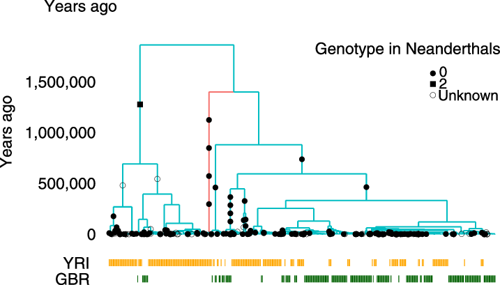

::: {.caption .floatright}
from Speidel et al
:::

## What can you do with the tree sequence?

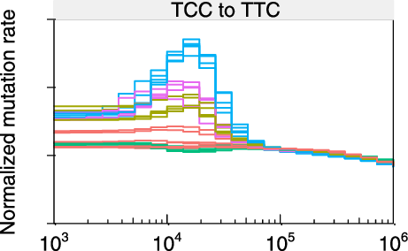

::: {.caption .floatright}
from Speidel et al; also see Harris (2015)
:::

## How to compare tree sequences?

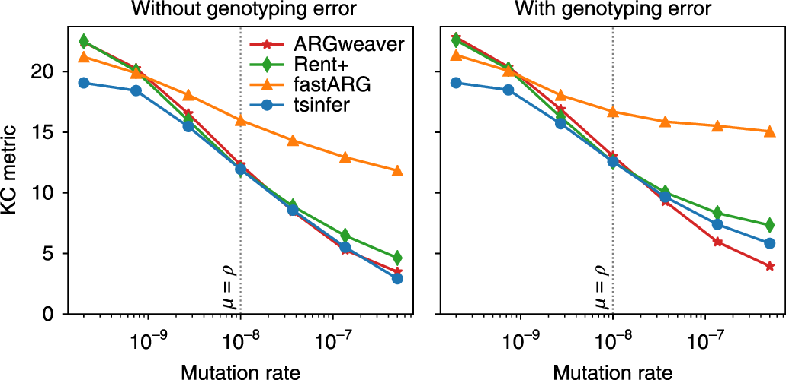{width=90%}

::: {.caption .floatright}
KC = average Kendall-Colijn tree metric;
from Kelleher et al
:::

## Open question

Define a metric on tree sequences that:

- measures both similarity of marginal trees
- *and* haplotype structure,
- and is efficiently calculable.

# Wrap-up

## 

*Tree sequences* are a very nice data structure for genomes
that derive from the *generative (genealogical) process*.

. . .

Lots to do on

- theoretical properties from generative processes,
- summaries and descriptive statistics,
- defining metrics, and
- **inference**!

## Code availability

::: {.columns}
::::::: {.column}

Everything is efficient, open, and tested:

- `tskit`: tree sequence tools 

    [github:tskit-dev/tskit](https://github.com/tskit-dev/tskit)

- `msprime`: coalescent simulator,

    [github:tskit-dev/msprime](https://github.com/tskit-dev/msprime)

- `SLiM` : forwards evolutionary simulator

    [messerlab.org/slim](https://messerlab.org/slim/)

:::
::::::: {.column}

{width=100%}

:::
:::::::

## Thanks

::: {.columns}
:::::::: {.column}

- Philipp Messer
- Boyana Norris
- Gil McVean
- Georgia Tsambos
- Yan Wong
- Simon Myers
- Wilder Wohns
- Kevin Thornton
- Graham Coop
- Gideon Bradburd
- Alison Etheridge
- CJ Battey
- Andy Kern

:::
:::::::: {.column}

- `tskit-dev`
- Jerome Kelleher
- Ben Haller
- Jared Galloway
- Jaime Ashander

Funding: NSF, UO (PR); Wellcome Trust (JK);

Slides with [reveal.js](http://hakim.se) and [pandoc](https://pandoc.org/).

{width=50%}

:::
::::::::

<!-- questions?? -->
## {data-background-image="figs/guillemots_thanks.png" data-background-position=center data-background-size=50%}
